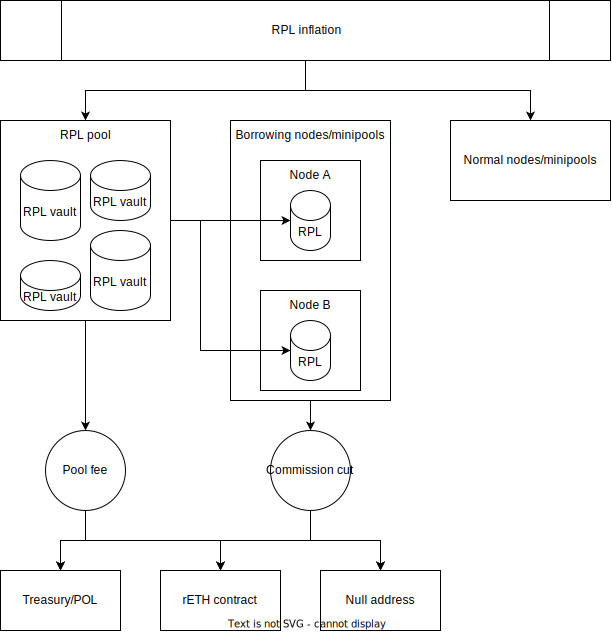

# Built-in RPL pool
## Summary
Current tokenomics require node operators to supply RPL to run minipools, and
it is known to be a blocker for risk-averse players, thus hindering RP growth.
Here I explore one possible way to enrich NO UX by allowing an option to create
minipools without the need to invest into RPL token. It is based on a built-in
RPL pool that lends RPL to such minipools and collects part of their commission.

## Details
### Seamless RPL borrowing
Right now operators who don't want to invest into RPL have an option to borrow
RPL from AAVE. A drawback of this option is that it requires more capital as
collateral for AAVE, and, an additional to NO duties, management of a loan. To
minimize a cost and a friction RP can implement its own RPL pool and a seamless
RPL borrowing from it, so that `smartnode` software manages a loan
automatically requiring minimal NO attention.

This can be based on
[RPIP-31: RPL Withdrawal Address](https://rpips.rocketpool.net/RPIPs/RPIP-31)
and
[RPIP-32: Stake ETH on behalf of node](https://rpips.rocketpool.net/RPIPs/RPIP-32).

### Implementation
1. RP builds its own RPL pool, similar to AAVE's.
    - This pool allows anyone to lock RPL and have a better APR than on AAVE
    (see Numbers for details).
    - This pool gives its participants voting rights, proportional to their
    share and RPL utilization.
2. `smartnode` shall allow a user to fund a minipool using automatically
borrowed RPL from the pool.
    - This loan does not need a collateral because the system borrows from
    itself (NO has no access to a borrowed capital).
    - In a simplest implementation borrowing minipools cannot be mixed with
    standard minipools on a single node. Mixing makes collateral calculations
    harder (per minipool vs per node).
3. Minipools funded this way get a share of RPL inflation as normal, but
claiming RPL rewards is different:
    - Instead of NO RPL rewards are claimed by the pool.
    - A portion or all RPL rewards goes to the pool
    - A portion (≥ 0) of RPL rewards can be burned or used in pDAO interests
    (think of it as a pool fee).
        - It is possible to collect a pool fee for funding a protocol owned
        liquidity, which will allow to reduce a pDAO share of RPL inflation in
        the future.
4. It is possible to set a slightly lower commission for minipools using
borrowed RPL in order to increase rETH APR or direct a deducted commission to
other places.
5. NOs have voting rights only from non-borrowing minipools, because running
minipools without owning RPL is not properly aligned with RPL/RP.

### Diagram

### Loan management
1. A loan from the pool has no interest to pay.
2. Before a snapshot, if RPL collateral falls below 10% due to price move,
either a `smartnode` or one of pool's smart contracts tops up RPL on borrowing
nodes to bring them back to 10%.
   - If there is not enough RPL in the pool to top up all nodes, it's not a
   problem. It means that the pool with utilization over 100% earns less
   interest, than a maximum possible, hence incentivizing people to supply RPL
   to bring it back to full capacity.
3. Before a snapshot, if RPL collateral exceeds 150%, `smartnode` withdraws
excess RPL back to the pool.
   - This is unlikely to lead to significant loss of gas for transactions
   because going from 10% to 150% collateral is a rare event.

### Benefits
- Preserves current tokenomics.
- Protocol owned RPL pool allows to borrow RPL without a collateral, thus
maximizing capital efficiency for NO seeking to run minipools without
investment into RPL.
- Adds an option to run minipools for those who don't want to invest into RPL
token, thus expanding NO base.
- Minimizes friction compared to currently existing option of manual RPL loan
from a third party.
- Involves more RP stakeholders into governance.
- Gives RPL more utility by adding another option for RPL yield and governance
participation.

### Drawbacks
- More smart contracts...

### Numbers
I assume here LEB8 as the only available option for simplicity.

In general a RPL valuation model stays the same as it is now, because all
minipools still bond RPL.

#### Pool possible APR
Inputs:
Current RPL APR = 7.27%.
Current RPL price = 0.014.
Current AAVE utilization = 40% (or 190K of 480K RPL).

Imagine the same demand:
We get 1000 LEB8 funded (`190,000 * 0.014 / (24 * 0.10) ~= 1000`)
Pool APR is `0.0727 * 0.40 = 2.9%` which is twice as high as AAVE average RPL
supply APR 1.46%.

### Extra (out of scope)
#### Pool fee and deducted commission directions
Options presented here are not mutually exclusive and can be mixed, which
allows for a great flexibility for achieving desired outcomes.

Collected fees may be directed to:
1. rETH contract. This benefits rETH holders primarily.
2. Null address, i.e., effectively get burned. This benefits all RPL holders.
3. Protocol owned liquidity. This would allow to reduce a pDAO portion of
inflation and thus benefits standard NOs bonding their RPL and RPL pool
suppliers.
